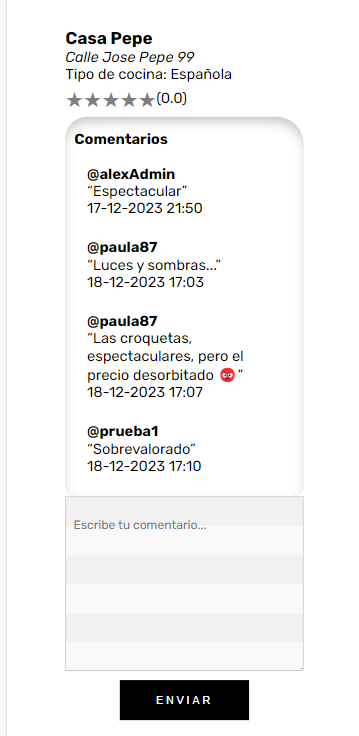

# BookEat 

Aplicación realizada como proyecto final del bootcamp de programación FullStack en The Bridge. 

Consta de una web app con una interfaz de usuario y de administrador para gestionar tanto reservas como los propios restaurantes. Este proyecto consta de un Frontend, realizado con React.js, y un Backend, con Node.js.

## Características

- **Búsqueda de Restaurantes**: Permite a los usuarios buscar restaurantes por nombre y tipo de cocina.
- **Detalles del Restaurante**: Los usuarios pueden entrar a ver en detalle el restaurante escogido y a su vez realizar la reserva en ella.
- **Gestión de Reservas**: Los usuarios pueden realizar, ver y cancelar reservas.
- **Comentarios y Valoraciones**: Los usuarios pueden dejar comentarios y valoraciones sobre su experiencia en el restaurante.



## Tecnologías Utilizadas

En este proyecto se han utlizado
- React.js
- Node.js con Express para el backend
- Base de datos relacional con PostgreSQL
- Axios
- JWT

## Instalación

Instrucciones para clonar el repositorio y ejecutar la aplicación localmente.

```bash
git clone https://github.com/alejandroFMA/ProyectoFullStackFinal
cd ProyectoFullStackFinal
npm install
npm start
cd client
npm install
npm start


```

###Contribuciones

Aún queda mucho trabajo por terminar para completar la aplicación. Si quieres ayudarme a participar, puedes contactarme o realizar un pull request del repositorio.

Proyecto realizado por Alejandro Márquez Andrade